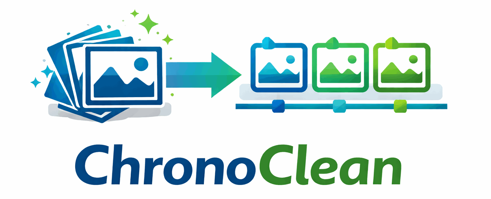

# ChronoClean


---

<p align="center">
  
</p>

<h2 align="center">Restore Time. Restore Order.</h2>

---

## Project Vision
Over the years, photo collections accumulate in many places: phones, cameras, messaging apps, backups, cloud exports, USB drives, “miscellaneous” folders on a NAS, and even old SD cards.
The result is usually a chaotic archive of:

- inconsistent naming conventions
- missing or broken EXIF dates
- photos in wrong folders
- duplicates scattered everywhere
- folders with meaningless names
- unsorted collections imported from past devices

**ChronoClean** is a practical, conservative tool whose goal is simple:
Reorganize decades of photos into a clean, consistent chronological structure, with safe renaming rules and optional folder-name tagging.

It is designed for real-life usage on large libraries (50k–300k files), including preparation for long-term archival on systems like a Synology NAS.

---
## Why the Name “ChronoClean”?
ChronoClean reflects the tool’s purpose:
- **Chrono** – time-based ordering at the heart of the system
- **Clean** – removing clutter, inconsistencies, duplicates, and chaotic structures

It focuses on rebuilding a clean chronological library without aggressively deduplicating or altering media unless needed.

---
## Purpose of the Tool

ChronoClean restores order to photo collections by:

- Reading EXIF timestamps when available
- Using fallback logic when EXIF is missing
- Organizing files into a time-based hierarchy
- Optionally renaming files using a standard pattern
- Optionally tagging filenames with relevant folder names
- Providing dry-run and export analysis before modifying anything
- Ensuring safe handling of duplicates or filename conflicts

The philosophy is:

- Predictable output
- Minimal risk
- Clear visibility before acting
- User-controlled decisions

ChronoClean does not attempt complex AI deduplication or modification of image contents.

---


## Features Overview

### Sorting & Organization
- EXIF-based sorting into a chronological folder hierarchy (year/month) (day optional)
- Fallback to creation/modification timestamp when EXIF is missing
- Optionally infer date from directory name if metadata is absent
- Consistent, predictable tree structure suitable for NAS archives and long-term storage

### File Renaming (Optional)
- Disabled by default; original filenames are preserved unless renaming is enabled
- Configurable renaming rules for standard, readable patterns
- Configurable folder-tag insertion for context-rich filenames
- Prevents double-tagging and name inflation

### Dry Run System
Two levels:
- **Dry-run console output**: shows exactly what would be done, without making changes
- **Export report**: JSON or CSV including:
  - source path and filename
  - detected date and date source (EXIF, filesystem, filename)
  - date mismatch detection (when filename date ≠ EXIF/file date)

This export can be reviewed before applying changes.

### Duplicate Management
- Only checked when needed (filename clash after sorting/renaming)
- Uses SHA256 for reliable comparison (MD5 optional via config)
- If same hash → skip second copy
- If different → rename second file safely to avoid collision

### Folder-Tag Logic
- Identify meaningful folder names for possible filename enrichment
- Detect if folder name already appears in filenames (distance-based logic)
- Tag enrichment is optional and user-controlled
- Possibility to maintain allow/ignore lists for folder tags

### NAS Compatibility
- Designed with Synology usage in mind
- Works on Python 3 installed on Synology
- Can be executed manually or via Task Scheduler
- Works well with shared folders and large volumes
- Instructions provided for installing dependencies and running the tool on Synology DSM

---

## Core Use Cases
1. **Clean chronological sorting**

Photo libraries often contain a mix of sources: phone backups, WhatsApp exports, SD card dumps, and more. ChronoClean reorganizes them into a clear, time-based structure:

```
2024/
  01/
  02/
2025/
  01/
  02/
```

Files are moved based on EXIF or fallback dates, ensuring chronological order regardless of original folder or filename chaos.

2. **Optional file renaming**

Many users prefer to keep original names, so ChronoClean provides renaming as optional, not default. When enabled, files are renamed using a standard, readable pattern:

```
20240214_153200.jpg
```

Or, with a folder tag for context:

```
20240214_153200_ParisTrip.jpg
```

3. **Folder-name influence**

Some folders contain meaningful names (e.g., “Paris 2022”, “SkiTrip”, “Mariage Julie”, “Naomie Anniversary”), while others are generic or unhelpful (e.g., “tosort”, “unsorted”, “misc”, “downloaded”).

ChronoClean allows you to:
- Tag folder names for filename enrichment
- Ignore folder names that are not informative
- Detect if the folder name is already present in filenames (using a similarity/distance check)

Folder tag detection is automatic during scan and apply. Configuration allows setting
ignore/force lists to control which folder names are used as tags.

4. **Duplicate handling**

Duplicate detection is not a feature goal but a safety mechanism:

If two files collide on filename (after sorting), ChronoClean checks their hashes.
- If identical: only one copy is kept (depending on options).
- If different: filename is adjusted to avoid collision.

ChronoClean does not attempt full-library deduplication unless explicitly requested.

---

## Workflow
ChronoClean follows a predictable, reversible flow:
1. **Scan** — analyze directories, read EXIF, classify folder names.
2. **Export** — produce JSON/CSV “plan” you can inspect or edit.
3. **Dry Run** — simulate actions using the plan; nothing is written.
4. **Apply** — perform sorting, moves, renames, and conflict resolution.

---

## High-Level Structure (indicative)
```
chronoclean/
  cli/
  core/
    exif_reader.py
    date_inference.py
    sorter.py
    renamer.py
    folder_tagging.py
    duplicate_checker.py
    export_plan.py
  utils/
  tests/
README.md
```

---


## Tech Stack (Flexible)

ChronoClean is implemented in **Python 3** for its readability, ecosystem, and easy deployment on Synology NAS.


The following libraries are recommended but not mandatory:
- **Pillow** (image metadata): Used for general image processing and reading/writing image metadata, including basic EXIF extraction and manipulation. Pillow is versatile and works with many image formats, but for advanced or lossless EXIF editing, see below.
- **piexif** or **exifread** (EXIF handling):
  - **piexif** is ideal for lossless EXIF extraction, insertion, and modification, especially when you need to preserve all metadata exactly or write EXIF back to files. It is more specialized for EXIF than Pillow.
  - **exifread** is focused on reading EXIF data only (no writing), and is robust for extracting metadata from a wide range of JPEGs and TIFFs.
- **hachoir** or **ffmpeg** (video metadata):
  - **hachoir** is a Python library for parsing and extracting metadata from many binary formats, including some video files.
  - **ffmpeg** is a command-line tool (can be called from Python) that extracts metadata from virtually any video or audio file, and is more comprehensive for multimedia.
- **hashlib** (hashing):
  - Provides cryptographic hashes (SHA256, MD5) for duplicate detection.
  - Included in Python's standard library; reliable and portable.
- **Typer** or **Argparse** (CLI):
  - **Typer** is a modern, user-friendly CLI framework based on Python type hints, making it easy to build intuitive command-line tools.
  - **Argparse** is Python’s built-in CLI parser, stable and widely supported, but with a more traditional interface.
- **pytest** (testing): Used for writing and running automated tests, ensuring code reliability and correctness.

Alternatives may be chosen depending on portability and Synology constraints.

---


## Synology NAS Installation (Overview)
1. Install Python 3 via Package Center  
2. Upload project folder to the NAS  
3. Install dependencies:
```bash
pip install -e .
# Or with dev dependencies:
pip install -e ".[dev]"
```
4. Run the tool:
```bash
# Analyze files
python3 -m chronoclean scan /volume1/photos
python3 -m chronoclean scan /volume1/photos --report  # Detailed per-file report

# Export scan results (v0.2)
python3 -m chronoclean export json /volume1/photos -o results.json
python3 -m chronoclean export csv /volume1/photos -o results.csv

# Organize files (dry-run by default)
python3 -m chronoclean apply /volume1/unsorted /volume1/photos

# Apply changes with copy (safe)
python3 -m chronoclean apply /volume1/unsorted /volume1/photos --no-dry-run

# Apply changes with move
python3 -m chronoclean apply /volume1/unsorted /volume1/photos --no-dry-run --move
```
5. Optionally schedule via DSM Task Scheduler

---

## Best-Practice Notes
- **Run on a copy of your library the first time**: Always test ChronoClean on a duplicate or backup of your photo collection to ensure the results match your expectations and to prevent accidental data loss.
- **Use the export report to tune tagging rules**: Review and edit the export (JSON/CSV) to refine folder-tagging, renaming, and conflict resolution before applying changes.
- **Ensure you have enough space for temporary moves**: Large reorganizations may require extra disk space for file operations, especially when working with tens of thousands of files.

---

## Configuration

ChronoClean can be configured via YAML files. Create a `chronoclean.yaml` in your project root:

```yaml
# Minimal config example
sorting:
  folder_structure: "YYYY/MM/DD"

folder_tags:
  enabled: true
  ignore_list: ["tosort", "misc", "temp"]

renaming:
  enabled: true
  pattern: "{date}_{time}"
```

**Config file search order:**
1. `--config <path>` argument
2. `chronoclean.yaml` in current directory
3. `.chronoclean/config.yaml`
4. Built-in defaults

**CLI arguments always override config file values.**

📄 **See [docs/CONFIGURATION.md](docs/CONFIGURATION.md) for complete configuration reference.**

---


## Roadmap

ChronoClean development follows a phased approach from prototype to production-ready tool.

> 📄 **See [docs/IMPLEMENTATION_SPEC_v0.1.md](docs/IMPLEMENTATION_SPEC_v0.1.md) for v0.1 implementation details.**  
> 📄 **See [docs/IMPLEMENTATION_SPEC_v0.2.md](docs/IMPLEMENTATION_SPEC_v0.2.md) for v0.2 implementation details.**  
> 📄 **See [docs/IMPLEMENTATION_SPEC_v0.2.md](docs/IMPLEMENTATION_SPEC_v0.2.md) for v0.2 planning.**

### v0.1 – Prototype ✅ Complete
- ✅ Project structure and configuration system (YAML-based)
- ✅ Data models (`FileRecord`, `ScanResult`, `OperationPlan`, `MoveOperation`)
- ✅ EXIF extraction and date parsing (images via `exifread`)
- ✅ Date inference engine with fallback priority (EXIF → filesystem → folder name)
- ✅ Chronological sorting into YYYY/MM folders (YYYY/MM/DD optional)
- ✅ Basic file renaming (optional, pattern-based with `{date}_{time}`)
- ✅ Folder tag detection (heuristics, ignore/force lists, fuzzy matching)
- ✅ Safe file operations (copy/move with dry-run, rollback support)
- ✅ CLI with Typer (`scan`, `apply`, `version`)
- ✅ Unit test suite (352 tests with pytest + pytest-mock)
- ✅ Dry-run mode (default) with `--no-dry-run` to apply
- ✅ Copy mode (default) with `--move` for moves
- ✅ Detailed scan report (`--report` flag)

### v0.2 – Export & Duplicate Detection
- ✅ Filename date parsing (detect dates in filenames like `IMG_090831.jpg`)
- ✅ Date mismatch detection (when filename date ≠ EXIF/file date)
- ✅ Export: JSON/CSV with detected dates, tags, target paths, mismatch info
- ✅ `export` command with `json` and `csv` subcommands
- ✅ Hash-based duplicate detection on filename collision (SHA256)
- ✅ Collision resolution strategies: check_hash, rename, skip, fail
- ✅ `config show` command to display current configuration
- Planned: `report` command for detailed analysis output

### v0.3 – Video & Advanced Metadata
- Video metadata extraction (hachoir or ffmpeg-python)
- Unified date handling for images and videos
- Enhanced EXIF/metadata error handling and logging
- Heuristic date clustering for files without metadata

### v0.4 – User Experience & Safety
- Interactive CLI prompts for export review and tag selection (Rich-based)
- Configurable allow/ignore lists for folder tags (persistent state)
- Progress bars and improved logging with Rich
- Safety checks: disk space verification, dry-run warnings, backup reminders
- `config set` command for runtime configuration changes
- Undo/rollback support with operation journal

### v0.5 – NAS & Large-Scale Support
- Optimizations for large libraries (100k+ files)
- Caching layer for EXIF data (SQLite-based)
- Synology DSM integration notes and best practices
- Task Scheduler compatibility and headless mode
- Parallel/multiprocessing for faster scans (configurable workers)
- Memory-efficient streaming for very large libraries

### v1.0 – Stable Release
- Full conflict resolution and rollback support
- Comprehensive NAS documentation
- Extended CLI options (filtering, simulation, advanced tagging)
- Test suite and CI integration
- User documentation and troubleshooting guide

### Beyond v1.0 (Ideas)
- Web-based UI for plan review and approval
- Advanced duplicate analysis (optional, opt-in)
- Customizable renaming/tagging templates
- Multi-language support
- Plugin system for custom workflows

---

<p align="center">
  
</p>

<p align="center"><i>ChronoClean — Order your memories.</i></p>
